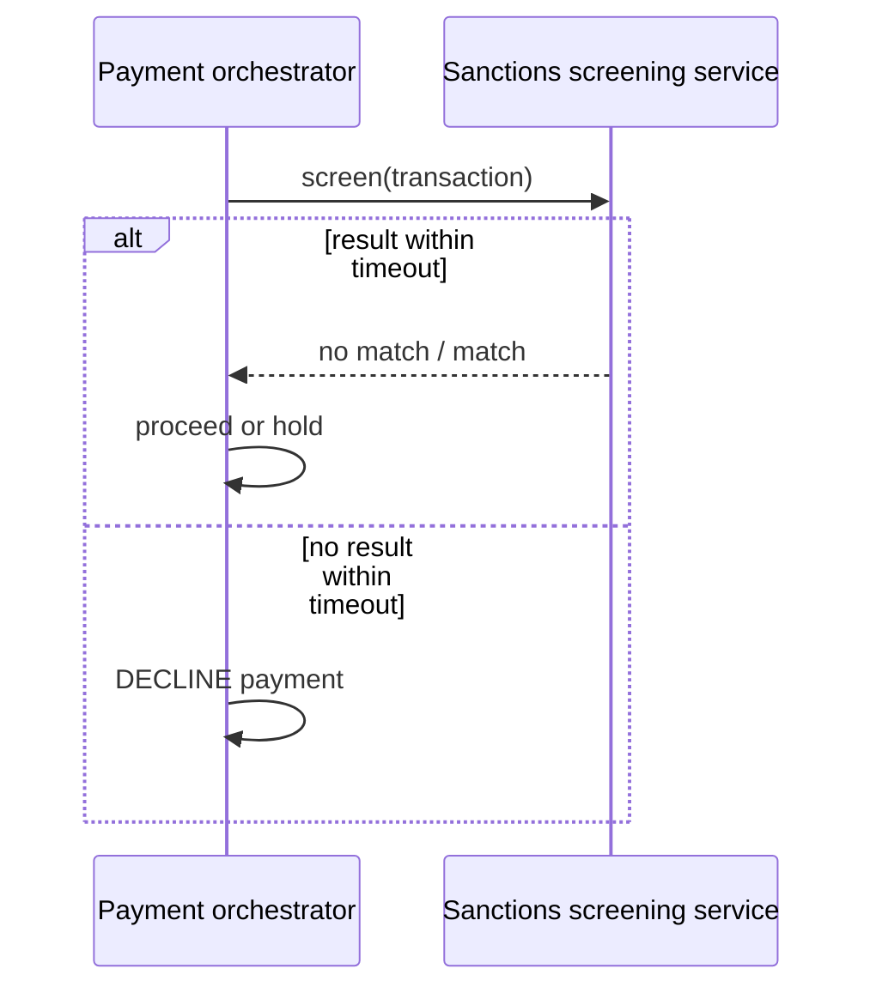
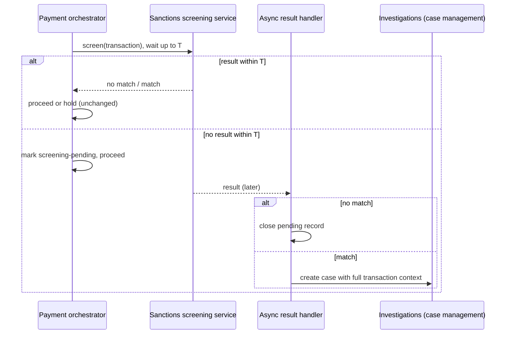

# Risk-Based Sanctions Screening: A Fail-Open Architecture for Payment Transactions

*Decoupling sanctions screening from the payment path with a configurable timeout, so a slow screening call never becomes a declined payment, and every request is still screened to completion.*

**Author:** Praveen Sridharan  
**Status:** Implemented in production at a global payments platform. Shared here as a reusable pattern.

## Abstract

Most payment platforms wire sanctions screening into the transaction path synchronously and fail closed: if the screening service does not answer, the payment is declined. That protects the firm from releasing a sanctioned transaction, but it also turns every screening slowdown into customer impact, and the customers affected are overwhelmingly legitimate. This paper describes a fail-open architecture for payment transaction screening. The payment path waits for the screening result up to a configurable service-level threshold. If the result arrives in time, it is honored as usual. If it does not, the payment proceeds and the screening request continues asynchronously to completion. A late match creates a case for the Investigations team. The threshold is a risk-appetite decision each firm makes for itself. Customer onboarding screening stays fail-closed; the pattern applies only to transactions from customers who have already been screened.

## Problem

Sanctions screening on a payment answers a narrow question: does anything about this transaction, chiefly the item being purchased and the parties named on it, match a sanctions list? For a customer who has already passed onboarding screening, the answer is almost always no. Yet the check sits synchronously in the payment path, and the payment cannot complete until it returns.

That coupling creates the following costs:

- **Customer impact from latency, not risk.** When the screening service slows down, because of list updates, traffic spikes, or a dependency failure, payments time out and are declined. The decline has nothing to do with the customer's risk.
- **Operational drag.** Every timed-out decline generates retries, support contacts, and manual review, and the retry usually succeeds, which proves the original decline was unnecessary.

## Current State: Synchronous, Fail-Closed

In the common design, the payment orchestrator calls the screening service and blocks. Three outcomes are possible: no match, so the payment proceeds; a match, so the payment is held or blocked; or no answer within the orchestrator's timeout, which is treated as a failure and the payment is declined. The third outcome is the problem. It is a technical failure handled as if it were a compliance decision.

## Proposed Approach: Fail-Open with Asynchronous Completion

The change is small in code and large in effect. The orchestrator still calls the screening service and still honors any result that arrives within the threshold. What changes is the third outcome: when the threshold passes without a result, the payment proceeds instead of being declined, and the screening request is not abandoned. It runs to completion in the background, and its result is acted on when it arrives.

1. **Screen with a time box.** The orchestrator sends the screening request and waits up to the configured threshold T.
2. **Result within T.** No match: proceed. Match: hold or block exactly as today. Nothing about this branch changes.
3. **No result within T.** Mark the transaction as screening-pending, and let the payment proceed. The screening request keeps running.
4. **Asynchronous completion.** When the result arrives: no match closes the pending record; a match creates a case for the Investigations team carrying the full transaction context.
5. **Downstream handling.** What Investigations does with a confirmed late match, such as holds, reversals, or regulatory reporting, follows the firm's existing procedures and is outside the scope of this architecture.

## Why This Is Risk-Based

Fail-open is not a blanket relaxation. It applies only where the residual risk of a late result is low, and the firm decides where that line sits.

- **Customers are already screened.** Onboarding screening remains synchronous and fail-closed. No unscreened customer reaches the transaction path. The transaction-time check covers the item being purchased and the details on the transaction itself, which is a narrower and lower-prevalence question.
- **Every request is still screened.** Fail-open changes when the result is acted on, not whether screening happens. A timed-out request is never dropped; it is completed and reconciled.
- **The threshold is a risk-appetite setting.** The timeout T, and which transactions are eligible for fail-open, are configuration owned by the firm's compliance function, not constants in code. A firm with a lower appetite sets a longer T or narrows eligibility; a firm with tight latency needs and strong upstream controls sets a shorter one.
- **Late matches have a home.** A match found after the payment proceeded is not lost in a log. It becomes a case with the transaction context attached, in the same case-management system Investigations already works from.

## Configuration

The following parameters are intended to be set per firm, and reviewed as part of the sanctions program's governance.

| Parameter | What it controls | Reference point |
| --- | --- | --- |
| Screening SLA threshold (T) | How long the payment path waits for a screening result before proceeding. | In the reference implementation, screening latency was about 100 ms at the 99th percentile and T was set at 200 ms, roughly twice the normal p99, so fail-open triggered only on genuine slowdowns. |
| Eligible transaction scope | Which payment types, rails, or amounts may fail open. Everything else stays fail-closed. | Firm's risk appetite; can start narrow and widen with evidence. |
| Pending-record retention | How long a screening-pending marker stays open before it is escalated as an unreconciled request. | Should be short enough that an unreconciled request is noticed the same day. |
| Case routing | Which Investigations queue receives late-match cases and with what priority. | Same routing rules as synchronous matches, flagged as post-execution. |

## Metrics

Two sets of numbers matter: the ones that prove the customer benefit, and the ones that prove the control still holds.

| Customer benefit | Control assurance |
| --- | --- |
| Screening latency at p50, p95, p99 | Share of requests that timed out and proceeded as pending |
| Declines caused by screening timeouts, before and after | Time from timeout to asynchronous result |
| Retry and support-contact volume tied to screening declines | Late-match rate, and how it compares with the synchronous match rate |
| Payment completion rate on eligible transactions | Pending records not reconciled within the retention window (target: zero) |

## Open Questions

- How should a firm express fail-open in its sanctions risk-appetite statement so that examiners see a deliberate, governed decision rather than a technical shortcut?
- Should T be a single value or tiered by transaction attributes, such as amount or rail? A single value is simpler to govern; tiers can protect conversion on the lowest-risk segments.
- What is the right evidence package to show that late-match handling is timely enough? The remediation steps themselves are out of scope here, but the architecture has to produce the evidence.

## Status

This architecture has been implemented in production at a global payments platform, screening on the order of tens of millions of transactions per day, with screening latency around 100 ms at the 99th percentile and the fail-open threshold set at 200 ms. It is shared here as a pattern other firms can adapt to their own risk appetite.

**About the author.** Praveen Sridharan is a product leader in financial crimes compliance with close to 20 years in technology and financial services, and 10+ years building KYC, sanctions, transaction monitoring, and investigations platforms for global payments and banking. linkedin.com/in/sridharanpraveen
