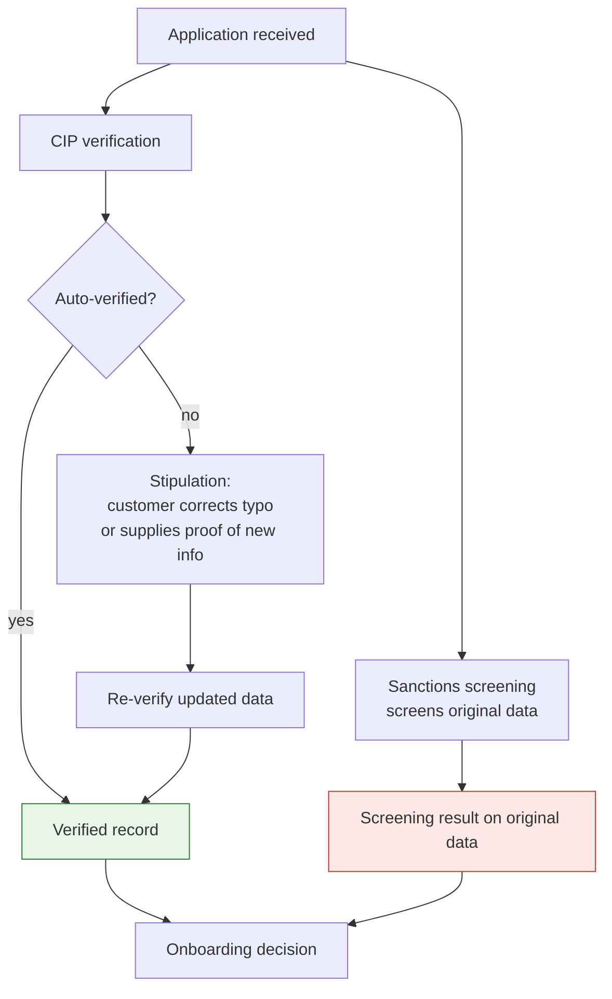
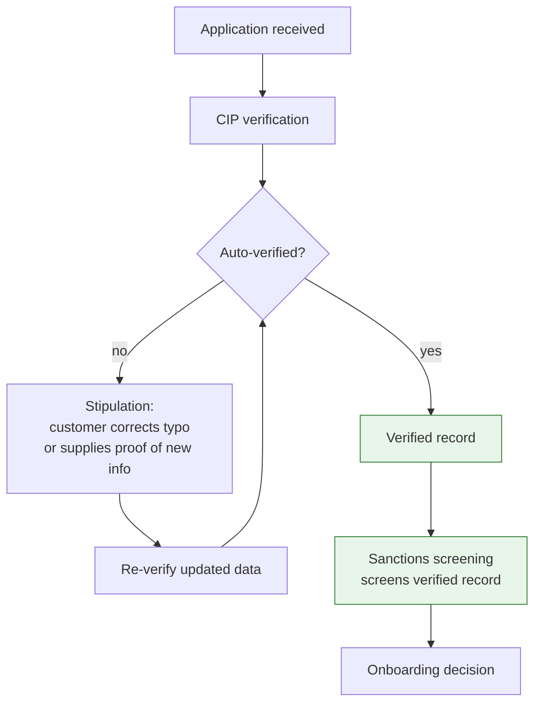

# Screen What You Verified: Sequencing Sanctions Screening After CIP Verification

*Onboarding flows commonly run identity verification and sanctions screening in parallel. Running screening after verification completes means the screened record is always the verified record.*

**Author:** Praveen Sridharan  
**Status:** Design recommendation for customer onboarding architecture.

## Abstract

During customer onboarding, most firms run two controls on the applicant's information: Customer Identification Program (CIP) verification, which confirms the applicant is who they claim to be, and sanctions screening, which checks the applicant against sanctions and watchlists. Because both start from the same application data, it is natural to run them in parallel. This paper argues for running them in sequence, with screening initiated only after CIP verification is complete. The reason is simple: the CIP process can change the applicant's information. Typos get corrected, and applicants supply details that identity vendors and credit bureaus did not have. When screening runs in parallel, it screens the pre-verification record, and the record that ends up on the customer profile may not be the one that was screened. The affected population is small, but the architecture should not depend on that.

## Problem

An onboarding application arrives with a name, date of birth, address, and an identity number. Two things happen next.

- **CIP verification** compares the application data against identity-verification vendors and credit bureau records. Most applications verify automatically. Some do not, because of a typo in the application, or because the applicant has information that is newer than what the vendors hold, such as a recent move or a name change.
- **Sanctions screening** compares the same application data against sanctions and watchlists.

When automatic verification fails, the firm raises a stipulation: a call to action asking the applicant to supply proof of identity or proof of address supporting the new information, or to correct the typo. The applicant responds, the record is updated, and CIP verification completes against the corrected data.

If screening ran in parallel, it ran against the original data. Whatever changed during CIP was never screened. Three things can now be true at once: CIP shows verified, screening shows clear, and the customer profile carries a name or address that no screening ever saw.

## Current State: Parallel Execution

In the parallel design, the orchestrator fans the application out to both controls as soon as it is received. Each returns independently, and the onboarding decision waits for both. The design is fast and simple, and it is correct for every application whose data does not change. The gap opens only on the stipulation path.

## Proposed Approach: Sequence Screening After CIP

Make CIP verification a precondition for sanctions screening. Screening is initiated when CIP reaches a terminal verified state, and it screens the record CIP verified, not the record the applicant first submitted.

1. **Receive the application** and start CIP verification only.
2. **Auto-verify path.** If the data verifies against vendor and bureau records, CIP completes and the verified record is passed to screening.
3. **Stipulation path.** If the data does not verify, raise the stipulation. The applicant corrects the typo or supplies proof of identity or address for the new information. Re-verify against the updated data until CIP reaches a verified state, or the application is declined.
4. **Screen the verified record.** Sanctions screening runs once, against the final verified name, date of birth, address, and identity number.
5. **Decide.** The onboarding decision uses a CIP result and a screening result that describe the same record.

## Why Sequence Rather Than Rescreen

The obvious alternative is to keep the parallel design and rescreen whenever the record changes. That works, but it is the more fragile option.

- **Rescreening depends on change detection.** Every field that feeds screening has to be watched, and every path that can update the record during onboarding has to trigger a rescreen. A field added later, or an update path that bypasses the trigger, reopens the gap silently.
- **Sequencing has no such dependency.** Screening cannot run before CIP finishes, so it cannot run on anything other than the final record. The guarantee comes from the order of operations, not from a trigger being maintained.
- **Parallel screening also screens data that is known to be wrong.** A typo in a name produces alerts on a name the applicant does not have. Those alerts consume analyst time and are discarded once the typo is corrected. Screening after CIP means analysts only ever review alerts on verified identities.
- **One screening event per application.** Sequencing produces one clean screening record per onboarded customer, tied to the verified identity. That is easier to evidence to an examiner than a screening on original data plus zero or more rescreens.

## What It Costs

The cost of sequencing is latency on the auto-verify path, and it is small. Screening is fast relative to CIP; a well-run screening service responds in the low hundreds of milliseconds, while CIP verification involves external vendor calls that take longer. Adding screening after CIP extends the happy path by roughly one screening round trip. On the stipulation path there is no added cost at all: the applicant is already waiting to supply a document, and screening runs after that document is processed either way.

Onboarding screening remains fail-closed in both designs. Sequencing changes when screening runs, not how strictly its result is applied.

## Considerations

| Consideration | Guidance |
| --- | --- |
| Auto-verify latency | Measure end-to-end onboarding time before and after. The expected increase is one screening round trip, which should be well within the CIP vendor call time already on the path. |
| Screening trigger | Screening is initiated by the CIP verified event, carrying the verified record. It should not be reachable from the application-received event. |
| Business customers | The same logic applies to KYB onboarding, where the business record and its related parties can change during verification. Screening the verified business and verified related parties follows the same sequence. |
| Ongoing screening | Post-onboarding changes to customer information are handled by ongoing screening, which is outside the scope of this paper. Sequencing closes the gap inside onboarding only. |

## Metrics

| What to measure | Why |
| --- | --- |
| Share of applications that take the stipulation path and change screened fields | Sizes the population the change protects, without needing to guess at it in advance |
| Screening alerts raised on pre-correction data (parallel design only) | Quantifies the analyst effort spent on identities that never existed |
| Onboarding duration on the auto-verify path, before and after | Confirms the latency cost is as small as expected |
| Screening events per onboarded customer | Should converge on exactly one, tied to the verified record |

## Open Questions

- Some firms want an early screen on raw application data to reject clearly sanctioned applicants before paying for CIP vendor calls. Is an optional pre-screen worth the added complexity, provided the authoritative screening still runs after CIP? Or does it reintroduce the confusion sequencing removes?
- How should the screening record reference the CIP verification it depended on, so the two can be shown together as one evidence package for the onboarded customer?

## Status

This is a design recommendation for onboarding architecture. The population it protects is small, and no attempt is made to size it here. The argument is that the sequence is right regardless of size, because it turns a control that is usually correct into one that is correct by construction.

**About the author.** Praveen Sridharan is a product leader in financial crimes compliance with close to 20 years in technology and financial services, and 10+ years building KYC, sanctions, transaction monitoring, and investigations platforms for global payments and banking. linkedin.com/in/sridharanpraveen
