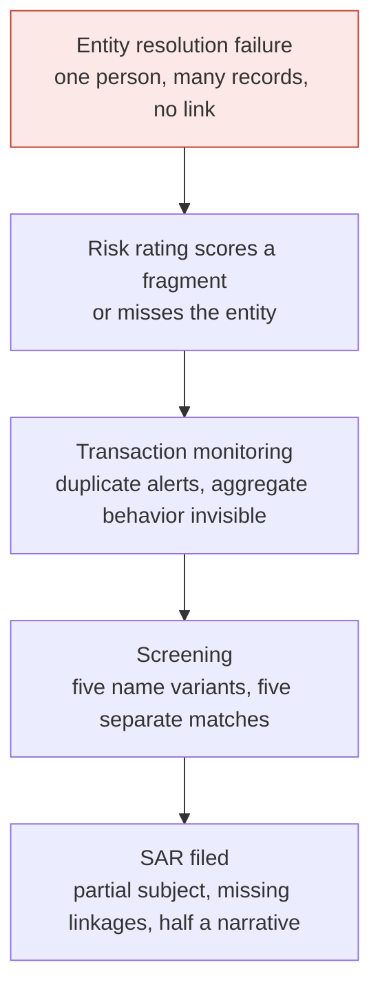

# Fix the Foundation: Why Entity Resolution Comes Before Everything Else in Financial Crime Compliance

*Most of a compliance program's effort goes into alerts, rules, thresholds, and filings. Almost none goes into the question that decides whether any of that works: do we actually know who we are dealing with?*

**Author:** Praveen Sridharan  
**Status:** Perspective, grounded in a production entity-resolution implementation.

## Abstract

Financial crime professionals spend their careers chasing alerts, calibrating transaction monitoring rules and thresholds, and filing suspicious activity reports (SARs). Very few pause to ask the most fundamental question first: do we actually know who we are dealing with? That question is answered by Entity Resolution (ER), the capability to accurately identify, deduplicate, and link every representation of an individual or business customer and their related parties across all of a firm's systems into a single, trusted, 360-degree view. When a firm gets ER wrong, the entire financial crime engine breaks down, and it breaks in a chain: risk rating scores the wrong entity, monitoring fires on noise, screening matches on name variants, and SARs go out with half the story. This paper makes the case that ER is a risk problem, not a technology problem, and that a firm should fix it before it expands, because every new product, system, and acquisition multiplies the number of ways one person can appear as several.

## The Question Nobody Asks First

A compliance program is a stack of controls that all consume the same input: an understanding of who the customer is. Know Your Customer (KYC) builds that understanding. Customer risk rating scores it. Sanctions screening checks it against lists. Transaction monitoring watches its behavior. Investigations reconstruct it. SARs describe it to law enforcement.

Every one of those controls assumes the entity it is looking at is the whole entity. In most firms, that assumption is false. The same person exists as a lending applicant in one system, a deposit customer in another, a counterparty on a wire in a third, and a beneficial owner on a business account in a fourth, with slightly different names, addresses, and identifiers in each. The controls run correctly on each fragment. None of them sees the person.

## What Entity Resolution Is

Entity Resolution is the capability to determine that several records, across several systems, refer to the same real-world entity, and to maintain that determination over time. It has three parts:

- **Identify.** Match records that describe the same individual or business, despite typos, name variants, transliterations, address formats, and missing identifiers.
- **Deduplicate.** Collapse matched records into one resolved entity with a stable identifier, and decide which attribute values survive when sources disagree, usually, the latest updated info wins.
- **Link.** Connect resolved entities to each other: beneficial owners to businesses, authorized signers to accounts, counterparties to customers, households to their members, and shared attributes such as phone numbers, devices, and addresses across otherwise unrelated records.

The output is a single, trusted, 360-degree view of each entity and its relationships, exposed to every downstream control through one identifier. The scope is not just customers. It includes counterparties, beneficial owners, and related parties, because that is where the networks hide.

## What Happens Operationally When ER Fails

From a SAR and AML operations standpoint, poor entity resolution is not a data-quality inconvenience. It is catastrophic.

- **Fragmented customer profiles.** The same criminal appears as three different customers across the CRM, the KYC system, and the transaction monitoring platform. The firm is monitoring fragments, not the whole picture.
- **An investigations nightmare.** Duplicate entities generate multiple alerts for the same underlying party. Investigators search across multiple records to reassemble one customer, burning analyst hours on noise instead of genuine threats.
- **SAR quality collapses.** A SAR is only as good as the identity behind it. Without resolved subjects, the narrative is incomplete, the subject information is partial, linkages are missing, and the filing is exposed to regulatory scrutiny.

## The Operational Domino Effect

Entity resolution failure does not create one problem. It creates a cascading chain reaction across the entire compliance program, and each link makes the next one worse.

1. **The risk rating engine scores the wrong entity**, or misses it entirely, because the attributes that would raise the score sit on a record it does not know is the same person.
2. **Transaction monitoring fires on noise and buries genuine red flags**, because behavior that would be suspicious in aggregate is spread across fragments that each look benign, while duplicate records generate duplicate alerts that exhaust analyst capacity.
3. **Screening produces false matches**, because the same entity carries five name variants across five systems, each of which is screened as if it were a different party.
4. **The SAR gets filed with incomplete subject information**, missing linkages, and a narrative that only tells half the story.

Every single one of those failures traces back to one root cause: the firm did not know who it was looking at.

## Not a Technology Problem. A Risk Problem.

Entity resolution is usually filed under data management and handed to a technology team as a matching project. That framing is why it stays unfunded. Matching records is the mechanism. The outcome is whether the compliance program can see the risk it exists to manage.

If ER is broken, KYC is incomplete, screening is unreliable, transaction monitoring is generating noise, and SARs are telling an incomplete story to law enforcement. No amount of rule tuning, threshold calibration, or analyst headcount fixes that, because all of it runs on the fragments. The firm's risk exposure is set by how well it can resolve entities, and that makes ER a first-line compliance responsibility with a business owner, a risk appetite, and a place in the program's governance.

## Why It Matters Most When a Firm Expands

A firm with one product and one system has an entity resolution problem it can mostly ignore. Every step of growth multiplies it. A new product brings a new onboarding path and a new customer table. An acquisition brings an entire second set of systems with their own identifiers. A new segment, such as adding deposits to a lending business, brings a population that overlaps the existing one in ways nobody has mapped. Each step adds another representation of the same people, and the gap between what the firm knows and what it can see widens.

That is why ER belongs at the front of an expansion plan, not at the end. Resolving entities across two systems before a third arrives is a bounded project. Resolving them across six systems after the fact, while alerts are already firing on fragments, is a remediation.

## What Good Looks Like

| Capability | What it means in practice |
| --- | --- |
| Matching across sources | Deterministic matching on strong identifiers, probabilistic matching on names, dates of birth, addresses, and contact details, with tolerance for typos, variants, and transliteration. Match thresholds are governed, not buried in code. |
| One resolved entity, one identifier | Every resolved individual or business carries a stable entity identifier that KYC, risk rating, screening, monitoring, and case management all consume. Records can change; the identifier does not. |
| Survivorship rules | When sources disagree, explicit rules decide which value wins, and the losing values are retained as aliases so screening and search still find them. |
| Relationship graph | Resolved entities are linked to related parties, beneficial owners, signers, counterparties, and shared attributes, so investigations start from the network rather than reconstructing it. |
| Coverage of the whole estate | Originations, servicing, CRM, KYC, monitoring, and case management all feed ER and all read from it. A system outside the scope of ER is a place for fragments to hide. |
| Stewardship | A defined owner reviews uncertain matches, resolves conflicts, and is accountable for match quality as a compliance control, with the same rigor as rule tuning. |

## Metrics

| What to measure | What it tells you |
| --- | --- |
| Records per resolved entity, by source system | How fragmented the estate is, and where |
| Alerts per resolved entity versus alerts per raw record | How much monitoring noise is duplication rather than behavior |
| Average time to assemble a full customer picture in an investigation | The operational cost of fragmentation, and the gain when it is fixed |
| Share of SAR subjects with complete identifiers and linked related parties | Whether filings carry the whole story |
| Share of screening alerts on aliases already resolved to a cleared entity | How much screening effort is spent re-clearing the same person |
| Uncertain-match backlog and time to steward | Whether the ER control is being operated, not just built |

## Open Questions

- Who should own entity resolution: the data organization that runs the matching, or the compliance function whose controls depend on it? The argument here is compliance, with data as the delivery partner, but most firms have it the other way around.
- How should probabilistic match thresholds be set and evidenced as a risk decision, given that a threshold set too loose merges different people and one set too tight leaves the same person split?
- Counterparties and beneficial owners often arrive with far less data than customers. How much resolution is achievable on sparse records, and how should the program represent the uncertainty rather than pretend it away?

## Status

This is a perspective piece, but it is grounded in practice. In one implementation the author led, resolving customer data across six systems spanning originations and servicing for both lending and deposit products cut average investigation time from about two hours to about thirty minutes, because investigators started from one resolved entity instead of assembling it by hand.

Fix the foundation. Everything else depends on it.

**About the author.** Praveen Sridharan is a product leader in financial crimes compliance with close to 20 years in technology and financial services, and 10+ years building KYC, sanctions, transaction monitoring, and investigations platforms for global payments and banking. linkedin.com/in/sridharanpraveen
