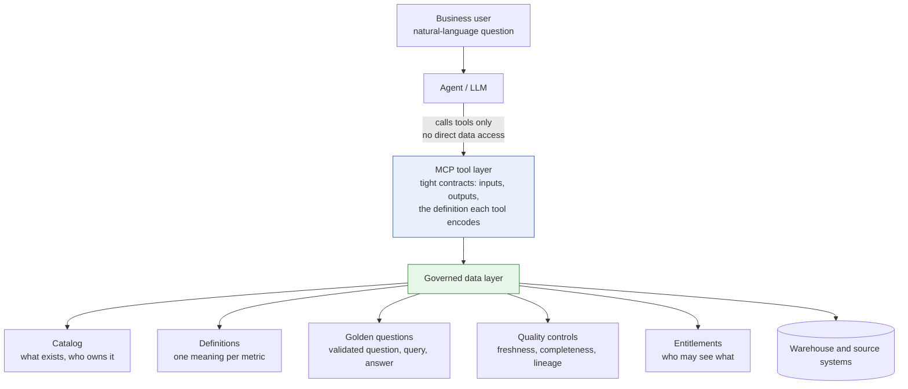

# The Product Manager as Librarian: Organizing Data So Agents Do Not Guess

*In the age of AI, the most valuable thing a product manager can do with data is not analyze it. It is catalog it, define it, and control its quality, so that any agent answering from it gives the same right answer every time.*

**Author:** Praveen Sridharan  
**Status:** Pattern drawn from a production AI analytics product and its governed data layer.

## Abstract

Large language models and the agents built on them are only as reliable as the data they can reach and the definitions they are given. Point an agent at a raw database and it will find something to say, whether or not it is right. Point it at a well-organized collection, with a catalog, controlled vocabulary, documented definitions, and quality controls, and its answers become consistent and checkable. That organizing work has a name in another profession: it is what a librarian does. This paper argues that in the age of AI the product manager's role shifts toward that of a librarian, responsible for the metadata and the controls around data quality, and describes the governed data layer that results. The pattern uses the Model Context Protocol (MCP) to expose data to agents through tightly defined tools rather than open access, and it is what makes agent answers consistent and keeps hallucination out of the answers a business user sees.

## The Shift

For most of the last decade a product manager's data work meant asking analysts for numbers, building dashboards, and occasionally writing SQL. The data itself was someone else's problem. AI changes the economics. Once an agent can answer questions in natural language, every business user becomes a query author, and the quality of what they get back depends entirely on how well the data underneath is organized and described.

An agent does not know that two tables both called customers mean different things, that revenue in one report excludes refunds while revenue in another includes them, or that the KYC refresh date in the warehouse lags the source system by a day. A human analyst carries that context in their head. An agent has only what it is given. If nobody has written it down, the agent guesses, and a confident guess is a hallucination.

## What a Librarian Does

A library is not a pile of books. It is a collection that has been organized so that a stranger can find the right thing without knowing where it is. The work behind that has direct equivalents in a data estate.

| Library practice | Data equivalent | What the product manager owns |
| --- | --- | --- |
| Catalog | Data catalog: every dataset, table, and field described, with owner, source, refresh cadence, and known limitations | That the catalog exists, is complete for the domain, and is kept current as products change |
| Classification and controlled vocabulary | Standardized definitions: one meaning for each business term and metric, with the calculation written down | That every metric the product exposes has exactly one definition, and conflicting ones are reconciled |
| Provenance and edition | Lineage and freshness: where each value came from, how it was transformed, and when it was last updated | That the lineage is visible to the agent and to the user, so an answer carries its date and source |
| Reference desk | Golden questions: validated question-and-answer pairs that show how the collection is meant to be used | That the questions users actually ask are captured, answered correctly once, and reused |
| Access policy | Entitlements: who may see what, enforced at the tool boundary, not in the prompt | That agent access follows the same rules as human access, with no shortcut |
| Weeding | Retiring stale datasets and duplicate tables so they cannot be found and used by mistake | That the collection stays small enough to be trusted |

None of this is new. Data governance teams have argued for all of it for years, and it has often gone unfunded because the payoff was diffuse. AI makes the payoff immediate and visible: an agent on an organized collection answers correctly, and an agent on a disorganized one does not.

## Why It Matters for Agents and MCP

MCP gives an agent a standard way to call tools that a product team defines. That makes it the natural place to apply the librarian's discipline, because the tool boundary is where the team decides what the agent can see and how it is described.

- **Tools instead of open access.** An agent with a raw SQL connection can query anything and will invent joins, filters, and metric logic as it goes. An agent with a set of MCP tools can only ask the questions the tools support, each of which encodes the right definition. The tool contract is the controlled vocabulary.
- **Definitions travel with the data.** When a tool returns a metric, it also returns what that metric means, how it was calculated, and when the data was refreshed. The agent has no reason to guess, and the user can see the basis for the answer.
- **Golden questions become tests.** A validated set of questions with known correct answers is both a reference desk for the agent and a regression suite for the product. Every change to the data layer is checked against them before it ships.
- **Consistency is the goal, not cleverness.** Two users asking the same question should get the same answer, and the same user asking twice should too. That is only possible when the definition lives in one governed place rather than being reconstructed by the model on each call.
- **Refusal is a feature.** A well-organized collection lets the agent say that a question cannot be answered from the available data. An agent without that structure answers anyway.

## The Governed Data Layer

The pattern has five parts, sitting between the agent and the underlying data.

1. **Catalog.** Every dataset the agent may touch is described: purpose, owner, source, refresh cadence, and known gaps. Anything not in the catalog is not reachable.
2. **Definitions.** Each business metric has one written definition and one implementation. Where two teams disagree, the product manager reconciles them before either reaches the agent.
3. **Golden questions.** The questions users ask most, each with a validated query and a known correct answer. They seed the agent's understanding of how the collection is meant to be used and serve as the regression suite.
4. **Quality controls.** Freshness checks, completeness checks, and reconciliation against source, so the agent can attach a date and a confidence to what it returns, and so stale data is flagged rather than served.
5. **Entitlements.** Access is enforced at the tool boundary. The agent inherits the user's permissions and nothing more.

## What the Product Manager Owns

The engineering of this layer belongs to data and platform teams. The ownership of what it contains belongs to the product manager, because the product manager is the one who knows what the questions are, what the answers should be, and which definitions the business has agreed on. Concretely, the product manager owns:

- The list of golden questions and their correct answers, and the process for adding to it as users ask new things.
- The metric definitions the product exposes, and the reconciliation when two sources disagree.
- The catalog entries for the product's domain, including the honest description of limitations.
- The decision about which questions the agent should refuse, because the data cannot support a reliable answer.
- The measurement of whether answers are consistent and correct, and the response when they are not.

This is not a technical role in the sense of writing the code. It is a curatorial one, and it is the highest-leverage thing a product manager can do for an AI product, because everything the agent says rests on it.

## Metrics

| What to measure | What it tells you |
| --- | --- |
| Golden-question pass rate | Whether the layer still answers the known questions correctly after each change |
| Answer consistency: same question, same answer, across users and repeats | Whether definitions live in the layer or are being reconstructed by the model |
| Incorrect-answer rate on sampled real questions, reviewed by a human | The hallucination rate a business user would actually experience |
| Correct-refusal rate: unanswerable questions declined rather than answered | Whether the collection's boundaries are working |
| Catalog coverage of the tables the agent's tools can reach | Whether anything reachable is undocumented |
| Unresolved definition conflicts | The backlog of librarian work still to do |
| Turnaround for an ad hoc business question, before and after | The productivity gain that justifies the curatorial investment |

## Open Questions

- How much of the catalog and definition work can itself be assisted by AI without reintroducing the guessing the layer is meant to remove? Drafting descriptions is safe; deciding which definition is correct is not.
- Where should the boundary sit between tightly scoped tools, which are safe but limited, and a broader query tool, which is flexible but easier to misuse? The answer probably depends on the user's expertise and the sensitivity of the domain.
- What is the right way to show provenance to a business user so that they trust an answer for the right reasons, rather than trusting it because it was fluent?

## Status

This pattern comes from a production AI-powered self-service analytics product for KYC operations, built with natural-language-to-SQL querying on top of a governed, MCP-based data layer designed with the firm's architecture team. The layer defined the tools, the golden questions, the catalog resources, and the standardized metric definitions the agent was allowed to use. It cut the turnaround for ad hoc business questions from one to two days to minutes, and it did so with answers that business users could trust because every one of them traced to a governed definition.

**About the author.** Praveen Sridharan is a product leader in financial crimes compliance with close to 20 years in technology and financial services, and 10+ years building KYC, sanctions, transaction monitoring, and investigations platforms for global payments and banking. linkedin.com/in/sridharanpraveen
